# :thought_balloon: Progressive Wavelet-Domain Multi-View Feature Collaborative Perception Network for Low-Light Image Enhancement
<div align=center>
  <a href="https://github.com/miguelag99/Efficient-Instance-Prediction/blob/main/CHANGELOG.md">
    
  </a>
  
    
  </a>
  <a href="https://pytorch.org">
    
  </a>
  <a href="https://lightning.ai/docs/pytorch/stable/">
    
  </a>
  <a href="https://www.docker.com">
    
  </a>
</div>


:eye: **This repository contains the official Pytorch implementation of training & evaluation code for [[WALLIE](https://github.com/promisedong/WALLIE)]**


## Introduction
### Low-Light Image Enhancement (LLIE) is a fundamental and critical task in computer vision, aiming to restore low-light images to normal illumination conditions while preserving local details and maintaining global color consistency. LLIE is essential for high-level vision tasks such as face detection in dim environments, object detection, video surveillance, and semantic scene segmentation, where the performance is often highly dependent on the quality of the enhanced images. However, due to nonlinear environmental factors and limitations of imaging devices, low light images often suffer from severe detail degradation, color distortion, and heavy noise, posing significant challenges to achieving high-quality enhancement.
<div align="center">
  
</div>
<p align="text-align"><strong>
 <textot>Figure 1: Visual Motivation and Key Insight of WALLIE. The first row presents enhancement results from
different network architectures and feature domain modeling strategies. WALLIE achieves the best visual
performance compared to all other methods. The second row presents the RGB histogram distributions of
the enhanced results by WALLIE, which closely match the ground truth, indicating accurate global color
restoration. The third row visually illustrates our core design: (h) illustrates how the input image/features
are transformed into the wavelet domain, generating four frequency components (e.g., HL, LH, YL, HH).
These multi-view frequency features undergo cross-domain interaction, producing output feature ‘Output’,
which significantly enhances the perception of local details and textures. Subsequently, after the high- and
low-frequency enhancement, the different frequency components are effectively separated and efficiently
aggregated, further highlighting the superiority of our proposed WALLIE framework.</strong>
</p>


<div align="center">
  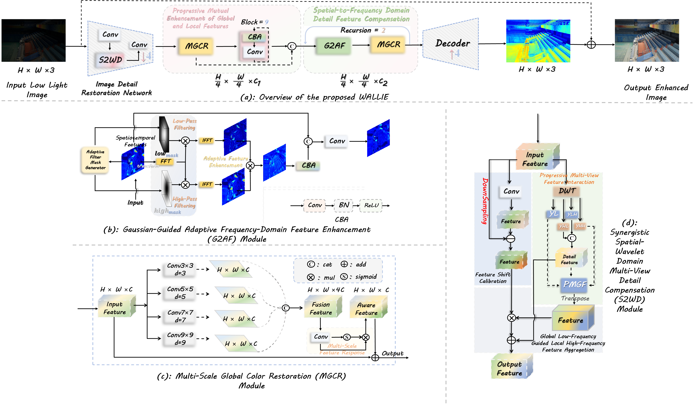
</div>
<p align="text-align"> <strong>
  Figure 2: (a) Overall architecture of the proposed WALLIE (The Image Detail Restoration Network reconstructs image details using cascaded convolutions combined with the S2WD module, with a down-sampling
factor of 4. In the decoder, skip connections are employed for feature aggregation, and up-sampling is
performed with a factor of 4); (b) The S2WD module employs a dual-branch architecture. The residual cascading branch captures high-detail perceptual features via element-wise subtraction between down-sampled
and original inputs. The progressive multi-view branch performs wavelet-based feature grouping and aggregation, followed by global contextual calibration using the PMGF module with a gating mechanism; (c)
The MGCR module facilitates global feature perception at multiple scales using wide receptive fields; (d)
The G2AF module enhances local detail features in the frequency domain under the guidance of a Gaussian
mask.</strong>
</p>


## Abstract:
<p style="text-align: justify;"><strong>
Low-light image enhancement (LLIE) remains a challenging task, particularly in simultaneously restoring fine-grained local textures and correcting global color distortions. Although frequency-domain modeling has recently been introduced to improve enhancement quality, existing methods often rely on simple down-sampling in the frequency space and limited single-view feature calibration, leading to artifacts such as color distortion, amplified noise, insufficient texture details, and local-global structural inconsistencies. To address these issues, we propose WALLIE, a Progressive Wavelet-Domain Multi-View Feature Collaborative Perception Network for Low-Light Image Enhancement. Specifically, we design a Synergistic Spatial-Wavelet Domain Multi View Detail Compensation (S2WD) module that leverages multi-branch feature cascades to jointly fuse spatial and frequency-domain representations. This enables effective detail compensation and structural consistency enhancement, mitigating the lack of fine texture restoration. In addition, we introduce a Progressive Multi-Group Global Feature Enhancement and Denoising (PMGF) module that performs group-wise enhancement and localized denoising, addressing global-local structural imbalance. To handle the global feature shift and color distortion caused by Fourier transforms, we propose a Gaussian-Guided Adaptive Frequency-Domain Feature Enhancement (G2AF) module, which adaptively captures salient spatiotemporal features based on Gaussian priors. Finally, we design a Multi-Scale Global Color Restoration (MGCR) module to guide hierarchical feature alignment, enabling progressive global color correction and consistent global color representation. The WALLIE achieves state-of-the-art (SOTA) performance on LLIE across nine public datasets, as well as on three high-level vision tasks: semantic segmentation, objection, and face detection across three public datasets. The code is available at: [WALLIE](https://github.com/promisedong/WALLIE).</strong></p>


## Installation
*We use [Pytorch2.5.1 + CUDA124] as  a software configuration environment.*

### Environment Installation
```
conda create -n WALLIE python=3.9.13
conda activate WALLIE
conda install pytorch torchvision torchaudio cudatoolkit -c pytorch

pip config set global.index_url=http://mirrors.aliyun.com/pypi/simple/
pip install numpy==1.24.4
pip install Pillow==9.3.0
tensorboardX==2.6.2.2
```

## Dataset 
<div align="center">
  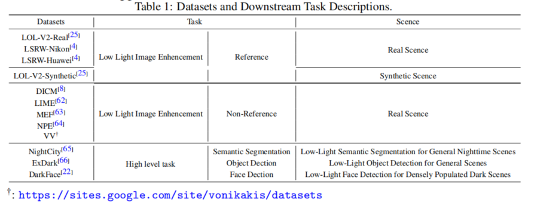
</div>
# *Results*
### *Result on the LOLV2 Datasets*
* **Quantitative comparison with state-of-the-art methods on LOLV2 datasets. The optimal results are marked with black bold, and the suboptimal  results are marked with an underline ‘‘–’’. **
<div align="center">
  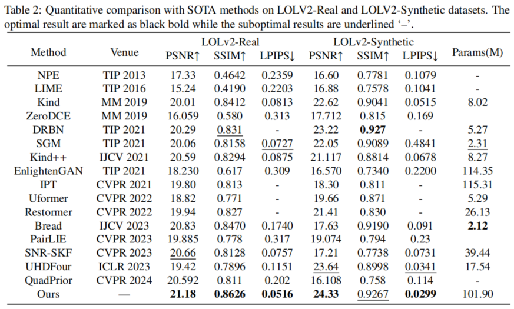
</div>


*  ***Visual comparison of segmentation results on LOL-V2-Real dataset***
<div align="center">
  
</div>
<p align="center">
  Visual comparison of segmentation results on  LOL-V2-Real dataset
</p>

*  ***Quantitative results of WALLIE and representative state-of-the-art methods on the LOLv2-Real dataset (PSNR and SSIM).***
<div align="center">
  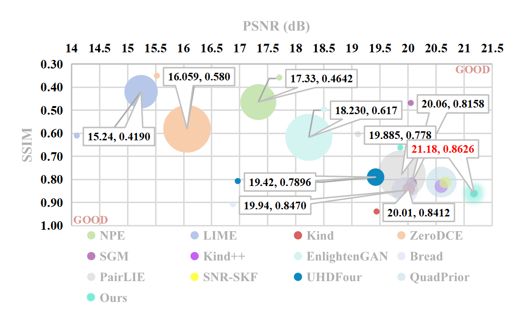
</div>
<p align="center">
 Quantitative results of WALLIE and representative state-of-the-art methods on the LOLv2-Real dataset (PSNR and SSIM). The bottom-right corner of the plot denotes higher PSNR and SSIM values, indicating superior image quality. The bubble size indicates the LPIPS score; smaller bubbles represent better perceptual quality
</p>


*  ***Visual comparison of results on LOL-V2-Synthetic dataset***
<div align="center">
  
</div>
<p align="center">
  Visual comparison of results on  LOL-V2-Syntheticl dataset
</p>


### *Result on the LSRW-Huawei Dataset*
* ***Quantitative comparison with state-of-the-art methods on LSRW-Huawei dataset. The optimal results are marked with black bold, and the suboptimal  results are marked with an underline ‘‘–’’. ***
<div align="center">
  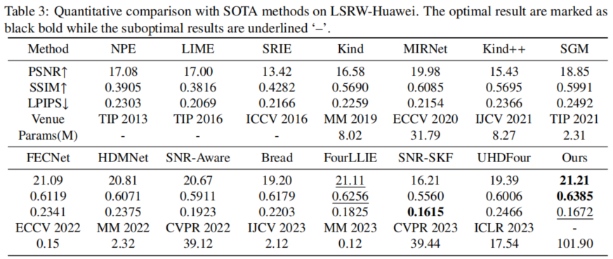
</div>


* ***Visual comparison of  results  on LSRW-Huawei dataset ***
<div align="center">
  
</div>

### *Result on the LSRW-Nikon Dataset*
* Quantitative comparison with SOTA methods on LSRW-Nikon. The optimal result are marked as

  black bold while the suboptimal results are underlined ‘–’.
<div align="center">
  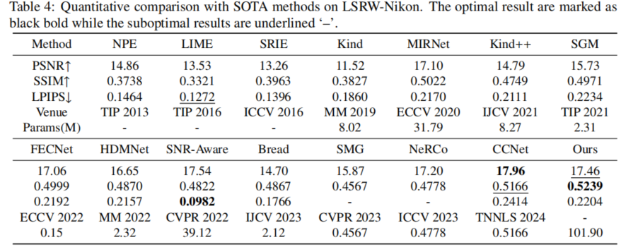
</div>


* Visualization results of various state-of-the-art methods on the LSRW-Nikon dataset. WALLIE

  consistently preserves fine details and achieves accurate color calibration, even under challenging and complex scene conditions. (Zoom-in for best view.)
<div align="center">
  
</div>


* ***Results of the non-reference Datasets***
<div align="center">
  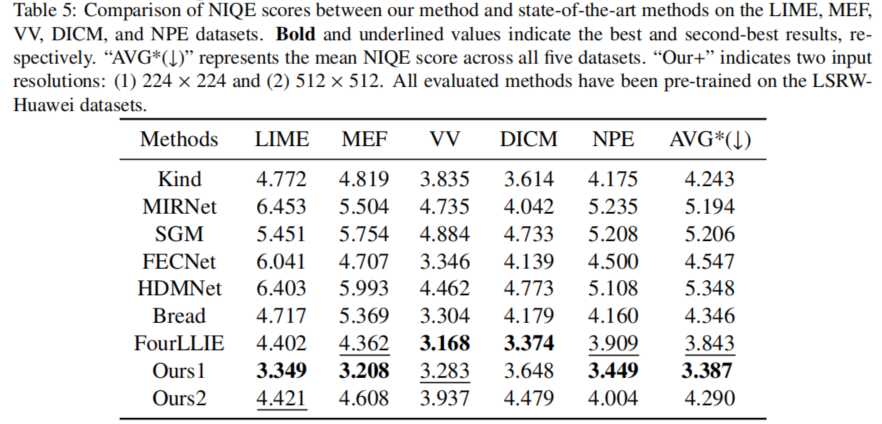
</div>


## *Applications of Low-Light Image Enhancement in High-Level Vision Tasks*

### *Low-Light Semantic Segmentation for General Nighttime Scenes*
<div align="center">
  
  <p>Qualitative comparison of our method and several state-of-the-art approaches on nighttime scene semantic segmentation. Red regions denote the predicted segmentation masks, illustrating model performance under challenging nighttime conditions. (Best viewed in red regions.)</p>
</div>
### *Low-Light Object Detection for General Scenes*
<div align="center">
  
  <p>Qualitative comparison of object detection results using our method and several state of-the-art approaches in low-light scenarios. Detection confidence and bounding box accuracy serve as indicators of the enhancement quality</p>
</div>
### *Low-Light Face Detection for Densely Populated Dark Scenes*
<div align="center">
  
  <p>Qualitative comparison of dense face detection results using our method and several state-of-theart approaches under complex scene conditions.</p>
</div>


## Ablation Study

### **Effectiveness of the proposed module:**
* **Ablation study of different modules. Components in the encoder and decoder are individually replaced or removed. ”×” indicates the absence of the corresponding module (for S2WD, ”×” means using only standard convolution). Bold numbers indicate the best performance, and underlined numbers denote the second-best.**
<div align="center">
  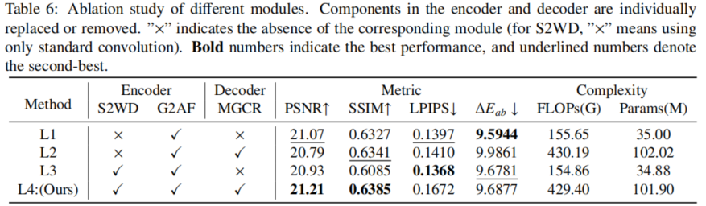
</div>


* **Visualization of Low-Light Enhancement under Severe Darkness and Color Degradation. (Red regions highlight the differences that require attention across different methods.)**
<div align="center">
  
</div>

* **Visualization of RGB Channel Discrepancies Between Enhanced and Ground-Truth Images. For curves of the same color, a closer distribution along the x-axis indicates better global color reconstruction (*i.e.*, hue consistency), while closer alignment along the y-axis reflects better local color restoration, preserving luminance and fine details.**
<div align="center">
  
</div>


### Effectiveness of the Proposed Loss Functions:
* **Ablation Study on Loss Functions. The models are trained on the LSRW-Huawei dataset. Bold values indicate the best performance, and underlined values denote the second-best.**
<div align="center">
  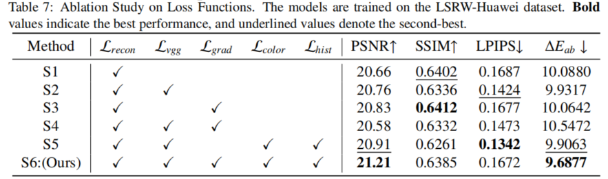
</div>

* **L2-Distance Heatmap Visualization. (Darker colors indicate a closer match between the enhanced image and the ground truth. Red regions denote the optimal viewing angles for evaluation.)**
<div align="center">
  
</div>


### **Ablation Study on the Impact of Di**fferent Down-sampling Modules on Network Feature Extraction Capability:
* **Ablation Study on Down-sampling Modules. (“w/” indicates the use of the corresponding module;  Bold values indicate the best performance, and underlined values denote the second-best.)**
<div align="center">
  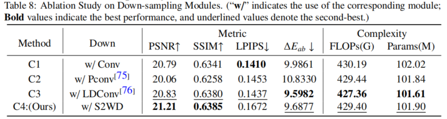
</div>


* **Visualization of Contour Structural Modeling Capability. (Red regions highlight discrepancies between various down-sampling modules and the ground-truth contours. Our WALLIE demonstrates superior local feature modeling ability with less noise.)**
<div align="center">
  
</div>

### Ablation Study on the Effectiveness of Different Frequency Domain Modules:
* **Ablation Study on Different Frequency Domain Modules. (“**w**/” indicates the use of the corresponding module; **Bold** values indicate the best performance, and underlined values denote the second-best.)**
<div align="center">
  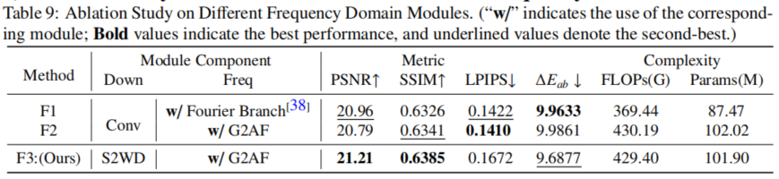
</div>

* **Visualization of Low-Light Image Enhancement with Different Frequency Domain Modules (The modeling capabilities of high- and low-frequency features are evaluated via enhanced amplitude and phase heatmaps. Model performance is reflected through amplitude discrepancy heatmaps, while local feature perception ability is indicated by L2-distance heatmaps.)**
<div align="center">
  
</div>


#### Parameters (M) and FLOPs (G) of proposed modules under a fixed input resolution. (*PMGF* is part of the *S2WD* module and is not separately analyzed.)

<div align="center">
  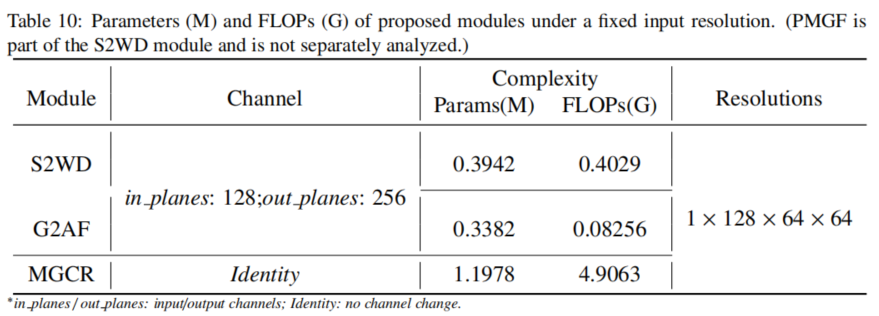
</div>
## **Limitation analysis**

<p style="text-align: justify;"><strong>
Although extensive comparative experiments, advanced vision tasks, and ablation
studies have thoroughly demonstrated WALLIE’s superior performance in low-light
enhancement, we acknowledge two potential limitations: (1) Local color distortion 
in extreme low-light scenes: when input images suffer from severely degraded color 
features in certain local regions, the perceptual interaction may fail. In such cases, 
the model relies on training-set statistical features for global color calibration, which 
can lead to local color distortions (see the first and second rows of Figure 17). (2) 
Smoothing of high-frequency texture details: for structures requiring fine-grained reconstruction (e.g., wall tile textures), even though the S2WD module compensates via 
multi-view local feature enhancement, the loss of original detail information in the input image can still result in overly smoothed reconstructed textures (see the third row
of Figure 17).
</strong>
</p>

<div align="center">
  
  <p><strong>Figure 17:</strong>Model limitation under extreme darkness. (The absence of local detail and color cues under extremely low-light conditions hinders the model’s ability to perform fine-grained enhancement.)</p>
</div>

## Visualization

* ***Method***
  * ***Mask visualization***
  * ***Frequency visualization***
  * ***Sobel(edge) visualization***
  * ***L2-Heatmap visualization***
  * ***RGB Channel Discrepancies***

## License
 The code is released under the MIT license[](https://opensource.org/licenses/MIT).


## Relevant Projects
***[1] DMFourLLIE: Dual-Stage and Multi-Branch Fourier Network for Low-Light Image Enhancement*** [**[MM 2024](https://arxiv.org/abs/2412.00683) [code](https://github.com/bywlzts/DMFourLLIE)**].
***[2] FourLLIE: Boosting Low-Light Image Enhancement by Fourier Frequency Information*** [**[MM 2023](https://arxiv.org/abs/2308.03033) [code](https://github.com/wangchx67/FourLLIE)**].
***[3] Low-Light Image Enhancement via Structure Modeling and Guidance*** [**[CVPR 2023](https://arxiv.org/abs/2305.05839) [code](https://github.com/xiaogang00/SMG-LLIE)**].
***[4] PTDA: Progressive Pseudo-Label Learning for Cross-Domain Cloud Detection in High-Resolution Remote Sensing*** [**[TGRS 2025](https://ieeexplore.ieee.org/document/10998457) [code](https://github.com/gasking/PTDA)**].
***[5] (Project)[https://github.com/gasking].***

- ***Thanks for their nice contribution.***


## Citation Information

***If you find this project useful, please give it a ⭐ and consider citing our work.***

```R
 @article{kuang2025sfgnet,
  title={SFGNet: Salient-feature-guided real-time building extraction network for remote sensing images},
  author={Kuang, Jin and Liu, Dong},
  journal={Knowledge-Based Systems},
  volume={317},
  pages={113413},
  year={2025},
  publisher={Elsevier}
}

@article{liu2025adaptive,
  title={Adaptive frequency-domain enhanced deep model driven by heterogeneous         networks for medical image segmentation},
  author={Liu, Dong and Kuang, Jin},
  journal={Knowledge-Based Systems},
  pages={113599},
  year={2025},
  publisher={Elsevier}
 }
```
